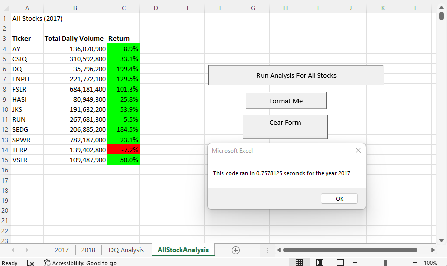
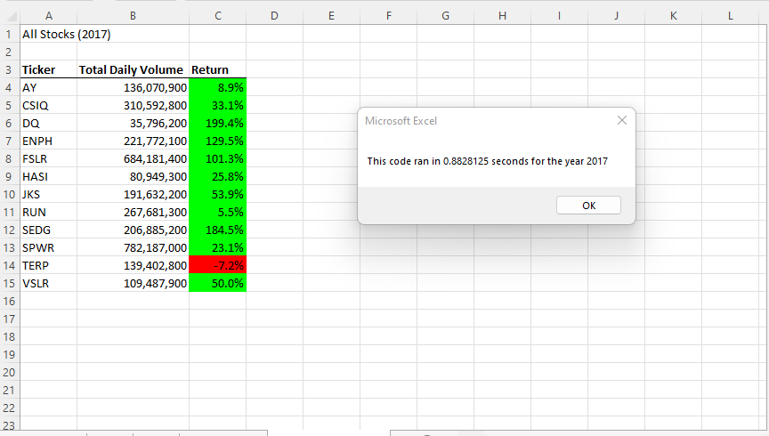
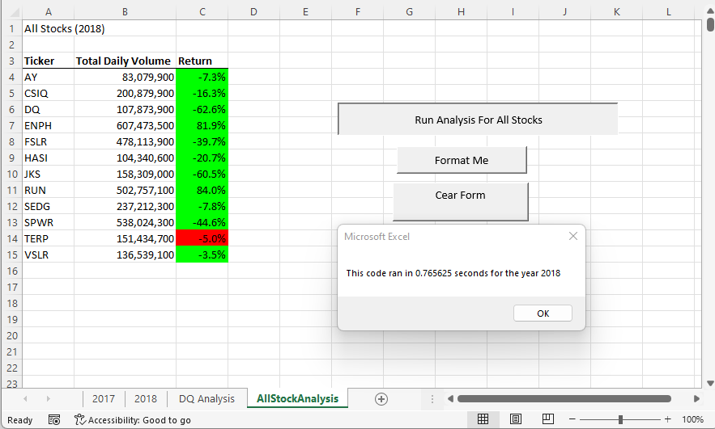
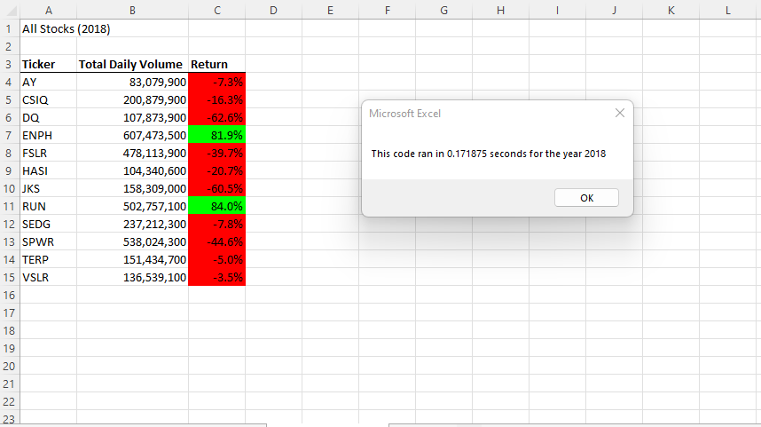

# VBA_Challenge Module 2

##  **Overview of Project**

This challenge focused on the refractor of coding. Steve had us pull the green stock analysis together, calculating the Annual Volume and the Annual Return for each stock for 2017 and 2018. In the process we made the code livable, so it could grow with Steve as the years passed. Now it was time to see if we could make the code more efficient. Efficiency comes in many forms such as:

    -Less Lines of Codes
    -Utilization of Less Memory
    -Better Logic
    -Easier to Read

## Results of Refacting 

If we are solely evaluating the results of the code on the time it took to run we could say the code was successful. We also need to look at the perfomance of th stocks between 2017 and 2018 and what if any effecienies we gained through the refactoring.  Was the savings of milliseconds worth the additions of new arrays and the changing of the code?

### Timing Sped Up
The 2017 Stock Analysis went from .7578125 down to .1328125 seconds to run, which is approximately a decrease of .63 seconds. While the 2018 Stock Analysis went from .765625 down to .171875 seconds to run, which is approximately a decrease of .59 seconds. There was no real decernable difference waiting on the processing of the stock analysis, per my 12 year old son. 
 
  
   
    

### Stock Performance
You can tell from the screen shots that the stock performance stays the same for both code versions.  The only standout item to note is 2017 was a much better year for the green stocks than 2018, in the later year the environmental stocks did not fair well and most returned a negative annual return. Hindesight is always 20/20 and the stock market crash and a Adminstration that was pro Gas and pro Coal may have had an effect on these company stocks. 

### Codeing Results
The biggest differnece between the Green Stocks code and the VBA Challenge code was the creation of the arrays for tickerIndex, tickerVolumes, tickerStartingPrices, and tickerEndingPrices. An array is like a set of store shelves we can put our information in as it is calculated and grab when it is needed.  The arrays sped the process of the calculations up by storing the information in the background as the code ran the loop. 

    ''1a) Create a ticker Index 
    ' Need an array for tickerindex, make Single since got Error 6 again at calculation of Return
    
    Dim tickerIndex As Single
    tickerIndex = 0
    
    '1b) Create three output arrays
    ' 12 tickers so denoting my floors to keep track and in like with ticker string
    
    Dim tickerVolumes(12) As Long
    Dim tickerStartingPrices(12) As Single
    Dim tickerEndingPrices(12) As Single
       
    
    ''2a) Create a for loop to initialize the tickerVolumes to zero.
    'index is floors and the bottom floor is 0 and goes to 11
    'tickerIndex will need to be used in my equations going forward- remember
    
    For tickerIndex = 0 To 11
    
    tickerVolumes(tickerIndex) = 0
    
    

    
    
    

Results: Using images and examples of your code, compare the stock performance between 2017 and 2018, as well as the execution times of the original script and the refactored script.
Summary: In a summary statement, address the following questions.
What are the advantages or disadvantages of refactoring code?
How do these pros and cons apply to refactoring the original VBA script?
